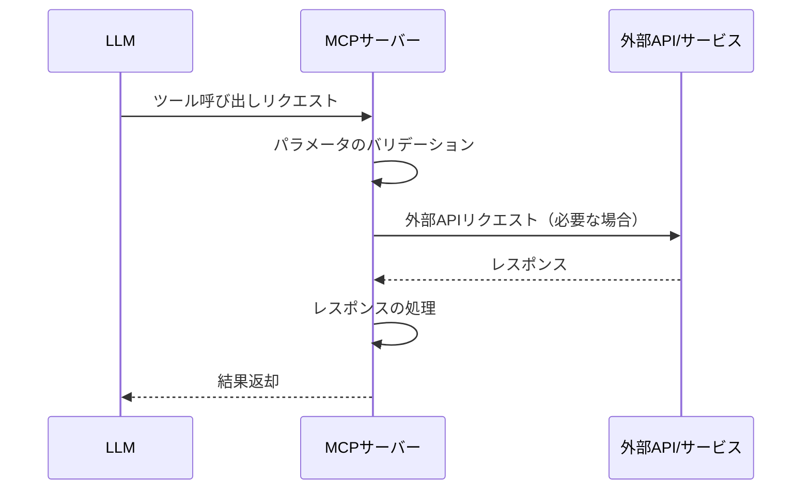

# 要件・設計書

## 1. 要件定義

### 1.1 基本情報
- ソフトウェア名称: MML MCP Server
- リポジトリ名: mcp-mml-server

### 1.2 プロジェクト概要

本プロジェクトは、MML（Music Macro Language）を処理するModel Context Protocol (MCP)サーバーを提供する。MMLからMIDIファイルへの変換、MIDIデバイスでの演奏、MMLの直接演奏機能を提供し、LLMが音楽制作や演奏に関するタスクを実行できるようにする。

### 1.3 機能要件

#### 1.3.1 MCPサーバーの基本実装
- JSON-RPC over stdioベースで動作
- MCP標準プロトコルに準拠したAPIエンドポイント
  - `initialize`: サーバーの初期化
  - `notifications/initialized`: クライアントの初期化完了通知
  - `tools/list`: ツール一覧の取得
  - `tools/call`: ツールの実行
  - `resources/list`: リソース一覧の取得
  - `resources/templates/list`: リソーステンプレート一覧の取得
- ツールの登録と実行のためのメカニズム
- エラーハンドリングとロギング

#### 1.3.2 MML処理ツール
- **MMLからMIDI変換ツール**: MMLテキストを入力としてMIDIファイルに変換して保存
- **MIDI演奏ツール**: MIDIファイルをMIDIデバイスで演奏
- **MML演奏ツール**: MMLテキストを直接演奏（内部でMIDI変換して演奏）
- **MMLバリデーションツール**: MML構文の検証
- **利用可能MIDIデバイス一覧ツール**: システムで利用可能なMIDIデバイスの一覧取得

#### 1.3.3 サンプルツール（既存）
- システム情報を取得するツール
- 現在の日時を取得するツール
- エコーツール（入力されたテキストをそのまま返す）

#### 1.3.4 拡張性
- 独自のツールを簡単に追加可能
- 外部モジュールからのツール登録をサポート

### 1.4 非機能要件

- 迅速なレスポンス
- シンプルな構成とメンテナンス性重視
- 拡張性の高い設計
- リアルタイム音楽演奏のための低レイテンシ

### 1.5 制約条件

- Python 3.10以上で動作
- JSON-RPC over stdioベースで動作
- MIDIデバイスが利用可能な環境

### 1.6 開発環境

- 言語: Python
- 外部ライブラリ:
  - `mcp[cli]` (Model Context Protocol)
  - `python-dotenv`
  - `mido` (MIDI処理)
  - `python-rtmidi` (リアルタイムMIDI)
  - `music21` (音楽理論・MML解析)

### 1.7 成果物

- MML処理機能を持つMCPサーバー
- MMLツール実装
- README / 利用手順
- 設計書

## 2. システム設計

### 2.1 システム概要設計

#### 2.1.1 システムアーキテクチャ
```
[MCPクライアント(Cline, Cursor)] <-> [MCPサーバー (Python)] <-> [外部API/サービス]
```

#### 2.1.2 主要コンポーネント
- **MCPサーバー**
  - JSON-RPC over stdioをリッスン
  - ツールの登録と実行を管理
- **ツールモジュール**
  - 各種ツールの実装
  - 入力パラメータの処理と結果の返却

### 2.2 詳細設計

#### 2.2.1 クラス設計

##### `MCPServer`
```python
class MCPServer:
    def register_tool(name: str, description: str, input_schema: Dict[str, Any], handler: Callable) -> None
    def start(server_name: str, version: str, description: str) -> None
    def _handle_request(request: Dict[str, Any]) -> None
    def _handle_initialize(params: Dict[str, Any], request_id: Any) -> None
    def _handle_notifications_initialized(params: Dict[str, Any], request_id: Any) -> None
    def _handle_tools_list(request_id: Any) -> None
    def _handle_tools_call(params: Dict[str, Any], request_id: Any) -> None
    def _handle_resources_list(params: Dict[str, Any], request_id: Any) -> None
    def _handle_resources_templates_list(params: Dict[str, Any], request_id: Any) -> None
    def _get_resources() -> List[Dict[str, Any]]
    def _get_resource_templates() -> List[Dict[str, Any]]
```

##### サンプルツール関数
```python
def get_system_info(params: Dict[str, Any]) -> Dict[str, Any]
def get_current_time(params: Dict[str, Any]) -> Dict[str, Any]
def echo(params: Dict[str, Any]) -> Dict[str, Any]
```

##### MMLツール関数
```python
def mml_to_midi(params: Dict[str, Any]) -> Dict[str, Any]
def play_midi(params: Dict[str, Any]) -> Dict[str, Any]
def play_mml(params: Dict[str, Any]) -> Dict[str, Any]
def validate_mml(params: Dict[str, Any]) -> Dict[str, Any]
def list_midi_devices(params: Dict[str, Any]) -> Dict[str, Any]
```

##### `MMLProcessor`
```python
class MMLProcessor:
    def parse_mml(mml_text: str) -> music21.stream.Stream
    def mml_to_midi_data(mml_text: str) -> bytes
    def save_midi_file(midi_data: bytes, filepath: str) -> None
    def validate_mml_syntax(mml_text: str) -> Tuple[bool, str]
```

##### `MIDIPlayer`
```python
class MIDIPlayer:
    def __init__(device_name: Optional[str] = None)
    def get_available_devices() -> List[str]
    def play_midi_file(filepath: str) -> None
    def play_midi_data(midi_data: bytes) -> None
    def stop() -> None
```

### 2.3 インターフェース設計

#### 2.3.1 MCP標準エンドポイント
- `initialize`: サーバーの初期化
- `notifications/initialized`: クライアントの初期化完了通知
- `tools/list`: 利用可能なツールの一覧取得
- `tools/call`: ツールの実行
- `resources/list`: 利用可能なリソースの一覧取得
- `resources/templates/list`: リソーステンプレートの一覧取得

#### 2.3.2 カスタムツールエンドポイント

##### 既存ツール
- `get_system_info`: システム情報を取得
- `get_current_time`: 現在の日時を取得
- `echo`: 入力されたテキストをそのまま返す

##### MMLツール
- `mml_to_midi`: MMLテキストをMIDIファイルに変換
- `play_midi`: MIDIファイルを演奏
- `play_mml`: MMLテキストを直接演奏
- `validate_mml`: MML構文を検証
- `list_midi_devices`: 利用可能なMIDIデバイス一覧を取得

### 2.4 セキュリティ設計

- 環境変数で機密情報を管理（`.env`）
- 外部からの直接アクセスは制限（ローカル環境前提）

### 2.5 テスト設計

- 単体テスト
  - 各ツールの機能テスト
  - MCPサーバーの基本機能テスト
- 統合テスト
  - MCPリクエストを模擬した動作確認

### 2.6 開発環境・依存関係

- Python 3.10+
- `mcp[cli]`
- `python-dotenv`

### 2.7 開発工程

| フェーズ | 内容 | 期間 |
|---------|------|------|
| 要件定義 | 本仕様書作成 | 第1週 |
| 設計 | アーキテクチャ・モジュール設計 | 第1週 |
| 実装 | 各モジュールの開発 | 第2週 |
| テスト | 単体・統合テスト | 第3週 |
| リリース | ドキュメント整備・デプロイ対応 | 第3週 |

## 3. MCPサーバーの開発ガイド

### 3.1 ツールの設計

ツールを設計する際は、以下の点を考慮する：

1. **目的と機能の明確化**
   - ツールが解決する問題を明確にする
   - 入出力の形式を決定する

2. **入力パラメータの定義**
   - 必須パラメータと任意パラメータを区別する
   - 各パラメータの型と制約を定義する

3. **出力フォーマットの決定**
   - 成功時の出力形式を定義する
   - エラー時の出力形式を定義する

4. **エラーケースの考慮**
   - 想定されるエラーケースをリストアップする
   - 各エラーケースの処理方法を決定する

### 3.2 ツールの実装パターン

```python
def my_tool_handler(params):
    try:
        # パラメータの取得と検証
        param1 = params.get("param1")
        if not param1:
            raise ValueError("param1 is required")

        # 処理の実装
        result = process_data(param1)

        # 結果の返却
        return {
            "content": [
                {
                    "type": "text",
                    "text": result,
                }
            ]
        }
    except Exception as e:
        # エラーハンドリング
        return {
            "content": [
                {
                    "type": "text",
                    "text": f"Error: {str(e)}",
                }
            ],
            "isError": True,
        }
```

### 3.3 ツールの登録パターン

```python
server.register_tool(
    name="my_tool",                # ツール名
    description="My custom tool",  # ツールの説明
    input_schema={                 # 入力スキーマ
        "type": "object",
        "properties": {
            "param1": {
                "type": "string",
                "description": "Parameter 1",
            },
        },
        "required": ["param1"],
    },
    handler=my_tool_handler,       # ハンドラ関数
)
```

### 3.4 MCPサーバーのシーケンス図


